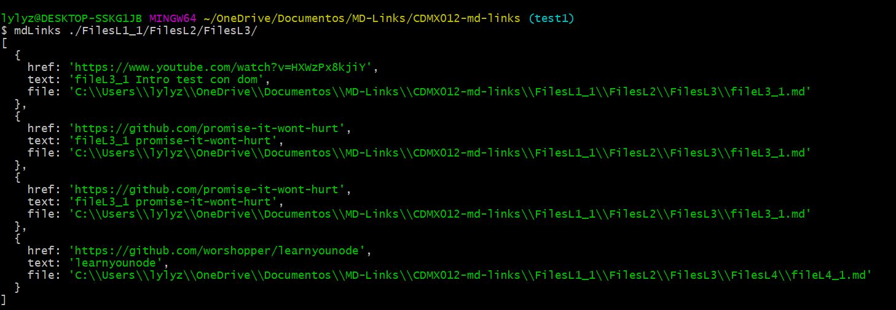
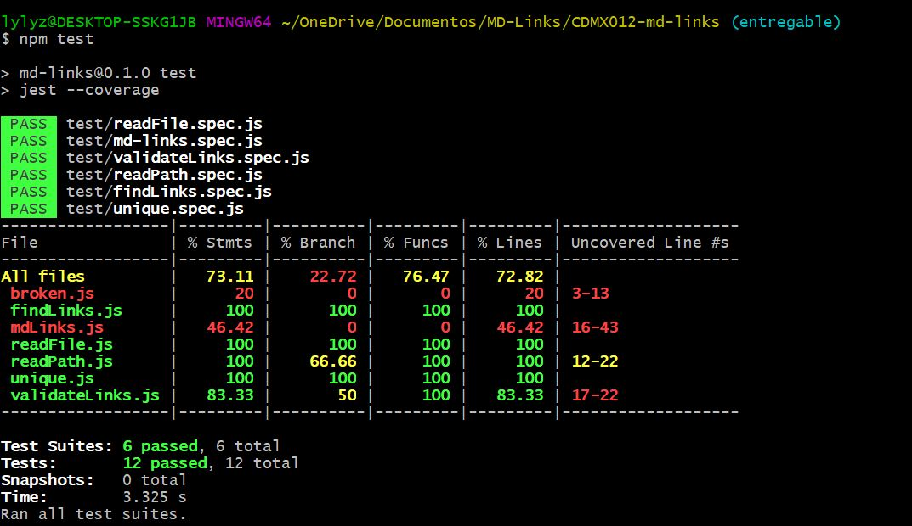

# Markdown Links

## Índice

* [1. Resumen del proyecto](#1-resumen-del-proyecto)
* [2. Planificación](##-2-Planificación)
* [3. Implementación](##-3-Implementación)

***
## 1. Resumen del proyecto

En este proyecto crearás una herramienta de línea de comando (CLI) así como tu
propia librería (o biblioteca - library) en JavaScript.

En esta oportunidad nos alejamos un poco del navegador para construir un
programa que se ejecute usando Node.js. Aprenderemos sobre procesos
(`process.env`, `process.args`, ...), cómo interactuar con el sistema archivos,
cómo hacer consultas de red, etc.

[Node.js](https://nodejs.org/es/) es un entorno de ejecución para JavaScript
construido con el [motor de JavaScript V8 de Chrome](https://developers.google.com/v8/).
Esto nos va a permitir ejecutar JavaScript en el entorno del sistema operativo,
ya sea tu máquina o un servidor, lo cual nos abre las puertas para poder
interactuar con el sistema en sí, archivos, redes, ...

Diseñar tu propia librería es una experiencia fundamental para cualquier
desarrollador porque que te obliga a pensar en la interfaz (API) de tus
_módulos_ y cómo será usado por otros developers. Debes tener especial
consideración en peculiaridades del lenguaje, convenciones y buenas prácticas.

## 2. Planificación

Para el diseño y la implementación de la herramienta se llevó acabo un plan de acción usando **Github Projects**

Se creó un diagrama de flujo.

## 3. Implementación

La presente herramienta permite leer del sistema de archivos, recibir argumentos a través de la línea de comando, analizar texto, hacer consultas HTTP.

Las opciones disponibles en línea de comando son las siguientes:

### API `mdLinks(path, opts)`

* [x] El módulo exporta una función con la interfaz (API) esperada.
* [x] Implementa soporte para directorios
* [x] Implementa `options.validate`

### CLI

* [x] Expone ejecutable `md-links` en el path (configurado en `package.json`)
* [x] Se ejecuta sin errores / output esperado
* [x] Implementa `--validate`
* [x] Implementa `--stats`

### Pruebas / tests

* [x] Pruebas unitarias cubren un mínimo del 70% de statements, functions,
  lines, y branches.
* [x] Pasa tests (y linters) (`npm test`).

